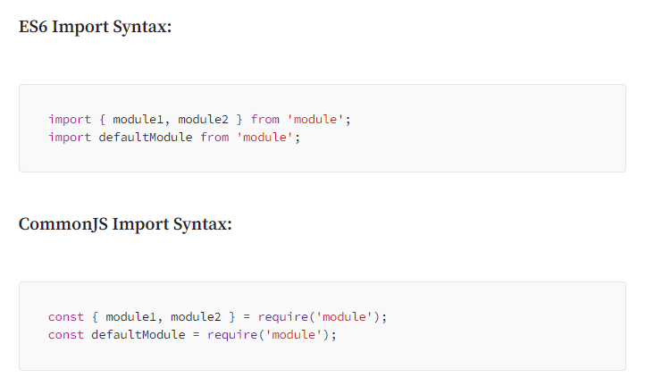

# quick-write
A blog post site built using Vue.JS, Express.JS and Postgres

## Development Enviroment

1. Working on a Windows 11 OS
2. Using GitBash as main terminal program
3. Using github as the origin repositry location
4. Using VSCode as main IDE
5. Starting with node version `v21.7.1`
6. Starting with npm version `v10.5.0`
7. Starting with eslint version `v8.57.0`
8. Starting with vue (using vue-cli) version `v5.0.8`
9. Using the postman app to test the endpoints


## Project Initlisation Steps

1. Start new repositry on Github named `quick-write`. Ensuring to use the `Node` preselect when opting for a `.gitignore` file.
2. Clone repositry to local machine using `git clone` command
3. Enter into the newly created `quick-write` directry using `cd quick-write` command
4. Creat a `client` and `server` directory using the `mkdir` commmand.

## Client Initlisation
1. Enter into client directroy `cd client`
2. Run `vue create .` to trigger the vue-cli.
3. Accept the current directroy `client` location suggestion.
3. Select `Vue 3` with `babel` and `eslint`.
4. Sit back and wait for it to install.
5. Notice now the `package.json` file outlining the packages installed. Contained in `node_modules` directory.
7. Notice the `babel` config directory
8. Note there is no Vue router installed yet. To install the router use the following command `npm install vue-router@4`
9. Add the following to the eslint rules in the package.json file.
```    
"rules":  {
      "no-unused-vars": "error",
      "no-undef": "error",
      "semi": ["error", "always"],
      "no-console": "error",
      "indent": ["error", 2],
      "no-trailing-spaces": "error",
      "quotes": ["error", "single"],
      "no-extra-semi": "error",
      "no-mixed-spaces-and-tabs": "error",
      "comma-dangle": ["error", "never"],
      "no-multiple-empty-lines": ["error", { "max": 1 }],
      "eol-last": ["error", "always"]
    }
```
---
10. Add the `axious` package to the `client` by running the `npm install axios` command in the `/client` directroy.
11. Again observe it being added to the `client` `package.json` file
12. Add a `client/src/service` directory to the prject.
13. inside the `services` folder add a file called `Api.js`
---
14. In `Api.js` use the `ES6` style of importing to get the `axious` package. Example: 
```
import axious from 'axious';
```
15. Now add a `export` statement (i.e following `ES6` rules)
```
export default () => {
    return axious.create({
        baseURL: `http://localhost:8081/`
    })
}
```
---
16. Add in an Authenicator class. Start by creating a new file called `services/AuthenticationService.js`

## Server Initilsation
1. Enter into `server` directory
2. Use `npm init` to creat an empty `package.json` file. Make sure to use all the defaults provided.Should look like the following:
```
{
  "name": "server",
  "version": "1.0.0",
  "description": "",
  "main": "index.js",
  "scripts": {
    "test": "echo \"Error: no test specified\" && exit 1"
  },
  "author": "",
  "license": "ISC"
}
```
3. Install `nodemone` and `eslint`  into the vaccant project. Using the `npm install nodemon eslint` command
4. Update the `scripts` section of teh `package.json` to include the commands to use `nodemon` and `eslint` when in development.
5. Add a new directory in `server` called `src`
6. Inside `src` add the starting javascript file of `app.js`
7. Initlise the eslint library  in the server by doing `npm init @eslint/config` and pcik the strictest one.
8. Use the advanced `JavaScript` method of `import/export`
9. Pick the `Vue.js` frame work
10. Our project does not use typescript
11. This is a backend service so the code will run in `node`
12. Use the satandard style guid
13. Have the configuration be in a `JavaScript` format.
14. Allow the `init` to install any dependencies it needs.
15. It should have succefully created a `.eslintrc.js` file
16. Observe the empty rules section which can be populated.
---
1. in `server/package.json` use the following scripts.
```
"scripts": {
    "start": "node node_modules/nodemon/bin/nodemon.js src/app.js --exec",
    "lint": "eslint **/*.js",
    "lint-fixer": "eslint --fix **/*.js"
  }
```
---
1. Now that we have amnually set up `nodemon` and `eslint` to be used in out dev enviroment we can move onto the packages we will be using in the backend program.
2. These packages are: 
* express
* body-parser
* cors
* moran 
3. To install this use the following command: `npm install express body-parser cors morgan`
4. Note how these have now been added to the `package.json` dependencies.
5. To import these remeber we are using advance version of JS (i.e `ES6`). Hence we need to make sure to follow the correct imports.
 - Some may work some may not. Also depends on how Babel converst it back into the old ways. For now we are not using babel (see the package.json file) but this has hit us in the past so just be aware.

## Backend API testing